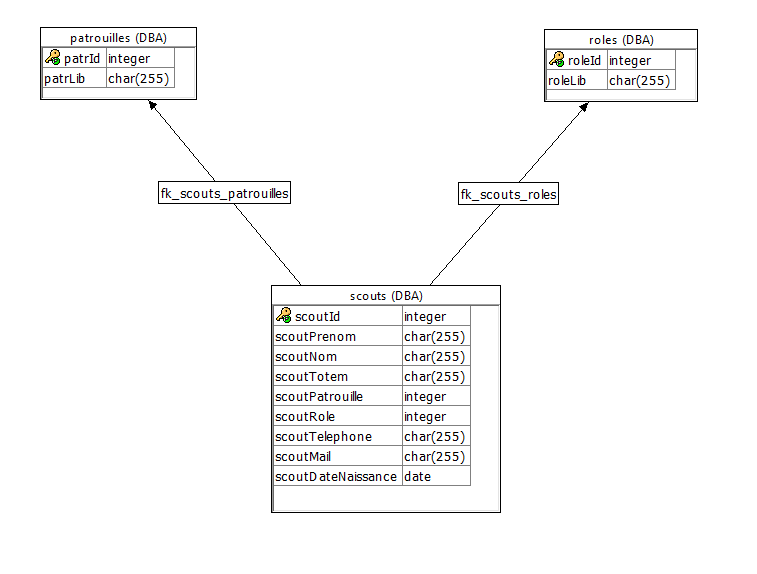

# Présentation de l'équipe
- Wassim Bouhdid
- Logan Carlier
- Louis Janquart
- ~~Grégory Theunissen~~
# Description du projet
## Besoin du client
Nous désirons une page web qui permet à un utilisateur d'inscrire des scouts et leurs données (prénom, nom, totem, patrouille, rôle, numéro de téléphone, adresse mail, adresse) dans une base de données. La page permet aussi de faire une recherche dans la base de données pour afficher une fiche reprenant toutes les données d'un scout sélectionné. Il serait pratique de pouvoir supprimer des scouts et de pouvoir modifier leurs données. Il serait aussi sympa que l'outil de recherche permette de rechercher des scouts sur la base de n'importe quelle donnée et d'afficher une liste de tous les scouts correspondant au critère de recherche.

## Fonctionnalités principales
- Un bouton "Listing" permet d'afficher un tableau reprenant tous les scouts et leurs données
- Un formulaire permet l'encodage d'un nouveau scout et ses données
- Une barre de recherche permet de rechercher un scout grâce à n'importe quelle donnée, une liste des scouts correspondants au critère de recherche est affichée
- Il est possible de sélectionner un scout dans la liste obtenue avec l'outil recherche. Une fiche reprenant toutes les données du scout est affichée. (Un bouton "Modifier" permet de modifier les données et un bouton "Supprimer" permet de supprimer le scout de la base de données.)
 
## Fonctionnalités supplémentaires
- (Il est possible de voir les autres membres de la patrouille d'un scout sélectionné)

# Tables

- **roles** -> reprend les différents rôles
- **patrouilles** -> reprend les différentes patrouilles
- **scouts** -> reprend tous les scouts et leurs inforamtions

# Webservices  
## **Services de base**
- **service root(:url)** -> renvoie la page si elle existe, l'index sinon.
Réponse:page HTML
- **service js(:url)** -> renvoie le fichier js à partir d'un nom ( avec extension )
Réponse: fichier js
- **service css(:url)** -> renvoie le fichier css à partir d'un nom ( avec extension )
Réponse: fichier css
- **service img(:url)** -> renvoie le fichier image à partir d'un nom ( avec extension )
Réponse: fichier image
- **service page(:url)** -> renvoie la page si elle existe, l'index sinon.
Réponse: page HTML

## **Services api rest**
- **service lister()** -> Renvoie une liste de tout les scouts encodé
Réponse:JSON[{scoutId,scoutNom,scoutPrénom}]
- **service fiche()** -> 
Réponse:JSON[{scoutId,scoutPrenom,scoutNom,dateNaissance,telephone,mail,totem roleLib patrLib}]
- **service inscrire(:nom,:prenom,:dateNaissance,:telephone,:email,:totem,:role,:patrouille)** -> renvoie les détails du scouts
Réponse: JSON[{nom,prenom}]
- **service supprimer()** -> supprime les données d'un scouts se trouvant dans la liste
Réponse:JSON[{status}]
- **service role()** -> Renvoie une liste des roles
Réponse:JSON[{roleId,roleLib}]
- **service patrouille()** ->Renvoie une liste des patrouilles
Réponse:JSON[{patrId,patrLib}]

